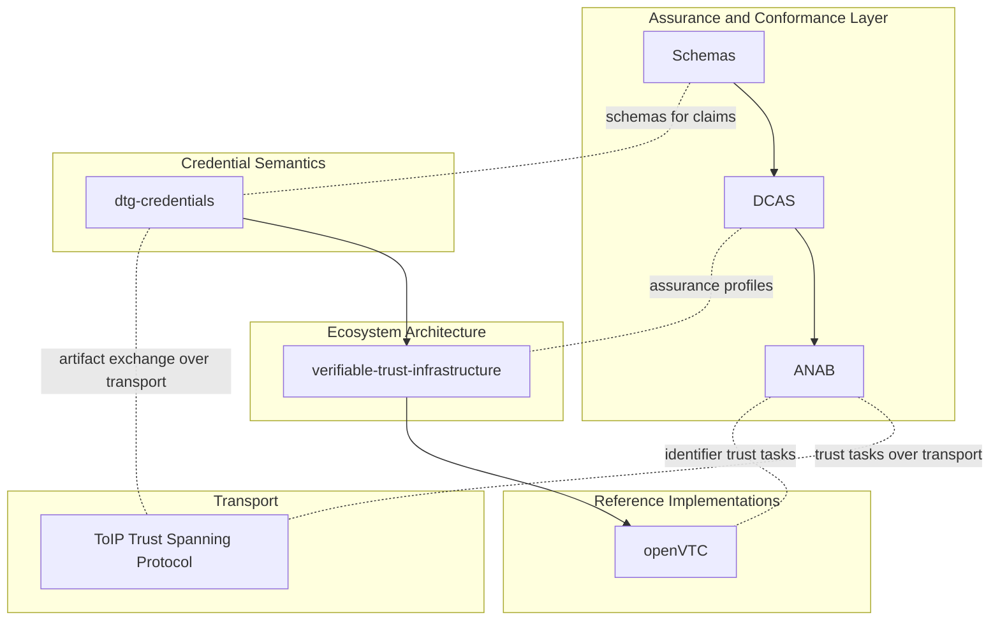

# Architecture snapshot

This diagram is a **non-normative** view of how this repository composes with DTG Labs upstream work and the ToIP Trust Spanning Protocol (TSP).

## Notes

- Solid arrows represent a typical dependency direction.
- Dotted edges represent interoperability touchpoints (mapping, evaluation, integration), not hard dependencies.
- The transport layer is shown as an adjacency to highlight where secure message exchange is expected to occur.
